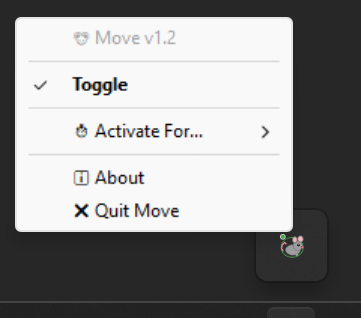
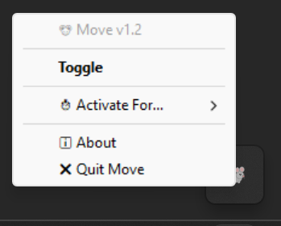
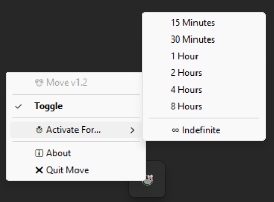

# 🐭 Move

> **A lightweight Windows system tray utility that keeps your PC awake without moving your mouse.**


Move is a lightweight Windows application that prevents your computer from sleeping by using the native Windows **SetThreadExecutionState** API.

Unlike traditional mouse jiggler applications, **Move does not simulate mouse movement or keyboard input**. Instead, it communicates directly with Windows, making it efficient, reliable, and non-intrusive.

---

## ✨ Features

* 🖥 Prevents Windows from sleeping
* 💡 Prevents the display from turning off
* 🐭 No fake mouse movement
* ⌨ No simulated keyboard input
* ⏱ Timer modes:

  * 15 Minutes
  * 30 Minutes
  * 1 Hour
  * 2 Hours
  * 4 Hours
  * 8 Hours
  * Unlimited
* 🚀 Automatically activates when launched
* 🎯 Runs quietly in the Windows system tray
* 🎨 Custom tray icon with active/inactive status
* ⚡ Minimal CPU and memory usage

---

## 📸 Screenshots

> *(Add screenshots here after creating a GitHub release.)*

### Active



### Inactive



### Timer Menu



---

## 📥 Installation

### Download the Executable

Download the latest version from the **GitHub Releases** page.

No installation is required—simply run the executable.

---

### Run from Source

Clone the repository:

```bash
git clone https://github.com/YOUR_USERNAME/Move.git
cd Move
```

Install the required packages:

```bash
pip install -r requirements.txt
```

Run the application:

```bash
python move1.2.py
```

---

## 📦 Requirements

* Windows 10
* Windows 11
* Python 3.10+

Python dependencies:

```text
pystray>=0.19.5
Pillow>=10.0.0
```

---

## ⚙️ How It Works

Move periodically calls the Windows API:

```python
SetThreadExecutionState(
    ES_CONTINUOUS |
    ES_SYSTEM_REQUIRED |
    ES_DISPLAY_REQUIRED
)
```

This tells Windows that your application is actively using the system, preventing:

* System sleep
* Display sleep
* Automatic workstation lock caused by sleep

Unlike mouse jigglers, Move:

* ✅ Never moves the mouse
* ✅ Never presses keyboard keys
* ✅ Doesn't interfere with games or presentations
* ✅ Uses Microsoft's recommended API

---

## ⏱ Timer Modes

Move supports multiple activation durations:

| Duration   | Description                        |
| ---------- | ---------------------------------- |
| 15 Minutes | Temporary activation               |
| 30 Minutes | Temporary activation               |
| 1 Hour     | Temporary activation               |
| 2 Hours    | Temporary activation               |
| 4 Hours    | Temporary activation               |
| 8 Hours    | Temporary activation               |
| Unlimited  | Stay awake until manually disabled |

---

## 🛠 Building the Executable

Move can be packaged into a standalone Windows executable using **PyInstaller**.

### Install PyInstaller

```bash
pip install pyinstaller
```

### Build

Run:

```bash
python -m PyInstaller --onefile --noconsole --name "Move1.2" --icon=move.ico --version-file=version_info.txt move1.2.py
```

After the build completes, the executable will be located in:

```text
dist/
└── Move1.2.exe
```

PyInstaller also creates:

```text
build/
dist/
Move1.2.spec
```

These files can safely be deleted and regenerated whenever you build a new version.

---

## 📂 Project Structure

```text
Move/
│
├── move1.2.py
├── move.ico
├── version_info.txt
├── requirements.txt
├── README.md
├── LICENSE
├── screenshots/
│   ├── tray-active.png
│   ├── tray-inactive.png
│   └── timer-menu.png
└── .gitignore
```

---

## 💡 Use Cases

Move is useful for:

* 📥 Large downloads
* ☁ Cloud uploads
* 🎬 Video rendering
* 💻 Remote Desktop sessions
* 📊 Presentations
* 🖥 Monitoring dashboards
* ⚙ Running scripts
* 🤖 Automation tasks
* 🧪 Software testing
* 🔄 Long-running processes

---

## 🤝 Contributing

Contributions are welcome!

If you'd like to improve Move:

1. Fork the repository.
2. Create a feature branch.
3. Commit your changes.
4. Open a Pull Request.

Bug reports and feature requests are also appreciated.

---

## ❓ FAQ

### Does Move move my mouse?

No.

Move never simulates mouse movement.

### Does it simulate keyboard input?

No.

Move uses the official Windows power management API.

### Does it require Administrator privileges?

No.

It runs as a normal desktop application.

### Does it install background services?

No.

Everything runs within the application itself.

### Does it affect performance?

No.

Move uses very little CPU and memory.

### Is it free?

Yes.

Move is completely free to use.

---

## 📄 License

This project is licensed under the **MIT License**.

See the `LICENSE` file for details.

---

## 👨‍💻 Author

**Mohamed Essarouri**

If you find this project useful, please consider giving it a ⭐ on GitHub—it helps others discover the project and motivates future development!
